# Bug Hunters

Systematic bug hunting with spec reconstruction, adversarial validation, and confidence-ranked reports. Hunt bugs, don't fix them.

## Philosophy

- **Spec-first** - can't find bugs without knowing intended behavior
- **Adversarial validation** - every finding challenged before reported
- **Confidence over severity** - certainty matters more than impact
- **Hunt, don't fix** - job ends at confirmed bug report
- **User decides** - present findings, never auto-remediate

## Agents

### orchestrator - Central Brain
Meta-agent coordinating systematic bug discovery. Two hunting modes with different lead/challenger roles.

**Modes**:
- **Logic-First**: algorithm bugs, spec gaps, design violations → `logic-hunter` leads, coding agents challenge
- **Code-First**: memory bugs, UB, async issues, type violations → language hunter leads, `logic-hunter` challenges

**Invokes**: All hunters + dev-experts coding agents (as challengers)

---

### logic-hunter - Spec Detective
Language-agnostic. Finds spec-vs-implementation gaps, data flow issues, algorithm failures.

**Modes**: Scan (hotspots) → Hunt (deep trace)

**Role**: Lead in logic-first, challenger in code-first

---

### cpp-hunter - C++ Bug Hunter
Memory corruption, UB, concurrency issues.

**Role**: Lead in code-first (C++), support in logic-first

---

### python-hunter - Python Bug Hunter
Async pitfalls, None propagation, type violations.

**Role**: Lead in code-first (Python), support in logic-first

---

## Flow

```mermaid
flowchart TD
    USER([USER]) --> orchestrator[/"orchestrator<br/>🔴 Central Brain"/]
    orchestrator --> Q{"Logic bugs or<br/>code-specific?"}

    subgraph logic_first [LOGIC-FIRST Mode]
        LH1["logic-hunter 🟠<br/>(lead)"]
        LANG1["language hunter 💛<br/>(support)"]
        CODE1["coding agent 💙<br/>(challenger)"]
        LH1 --> LANG1 --> CODE1
    end

    subgraph code_first [CODE-FIRST Mode]
        LANG2["language hunter 💛<br/>(lead)"]
        LH2["logic-hunter 🟠<br/>(challenger)"]
        LANG2 --> LH2
    end

    Q -->|"Logic"| LH1
    Q -->|"Code"| LANG2

    CODE1 --> V{CHALLENGE<br/>VERDICT}
    LH2 --> V

    V -->|FALSE_POSITIVE| discard["❌ Discard"]
    V -->|CONFIRMED| score["Confidence Scoring"]
    V -->|NEEDS_CONTEXT| rehunt["🔄 Re-hunt"]
    rehunt -.-> Q

    score --> report["📋 FINAL REPORT<br/>(MEDIUM+ confidence)"]
```



## Confidence Levels

| Level | Criteria |
|-------|----------|
| `CERTAIN` | Spec violation + reproducible + challenger confirmed |
| `HIGH` | Strong evidence + challenger failed to disprove |
| `MEDIUM` | Circumstantial evidence + known pattern |
| `LOW` | Suspicious but weak (filtered from report) |

## Key Rules

1. **Spec first** - no hunting without reconstructed specification
2. **Challenge everything** - every finding faces adversarial validation
3. **Hunt only** - no fixes, no remediation, just reports
4. **User decides** - present options at every decision point
5. **Filter low confidence** - only MEDIUM+ makes the report

## Collaboration with dev-experts

- **Logic-first**: `cpp-dev`/`python-dev` challenge hunter findings
- **Code-first**: `logic-hunter` challenges language hunter findings

This adversarial tension filters false positives.

---

## Color Scheme

❤️ RED = orchestrator (decider, coordinator)
🧡 ORANGE = logic-hunter (spec detective, can lead or challenge)
💛 YELLOW = language hunters (cpp-hunter, python-hunter)

---

## Installation

```bash
/plugin marketplace add git@github.com:DeevsDeevs/agent-system.git
/plugin install bug-hunters@deevs-agent-system
```
