# Dev Experts

Critical, opinionated developer personas as autonomous agents. Claude invokes them automatically based on task context, or you can invoke manually.

## Agents

### architect - Technical Lead & Architect
Auto-invoked for feature design and implementation planning. Critical, explores alternatives, creates actionable plans.

**Workflow**:
- Interrogates requirements
- Challenges assumptions
- Explores 2-3 alternatives with trade-off analysis
- Asks you to choose
- Creates implementation plan in `.claude/experts/plans/[slug].md`

**Auto-invoked when**: Designing features, architecture decisions, implementation planning

---

### devops - Production Detective
Auto-invoked for debugging production issues and infrastructure problems. Methodical and systematic.

**Workflow**:
- Gathers evidence (symptoms, timing, changes)
- Forms hypotheses (2-3 root causes)
- Tests systematically
- Provides diagnostic commands and investigation path

**Auto-invoked when**: Production issues, mysterious bugs, deployment failures

---

### rust-dev - Rust Purist
Auto-invoked for Rust code review and refactoring. Hunts un-Rusty patterns.

**Focus**:
- Ownership & borrowing issues
- Error handling patterns
- Type system usage
- Async correctness
- Performance optimizations
- Safety violations

**Refactoring Mode**: Invoke with "refactor for maintainability" to get comprehensive refactoring plans saved to `.claude/plans/[slug]-ref.md`

**Auto-invoked when**: Rust code review, idiom improvements, refactoring requests

---

### python-dev - Pythonista
Auto-invoked for Python code review and refactoring. Hunts un-Pythonic code. Mandates UV and msgspec.

**Focus**:
- Type safety (hints, msgspec validation)
- Async pitfalls
- Error handling
- Modern Python features (3.10+)
- Data structures (dataclasses, TypedDict)
- Code smells

**Mandates**: UV for package management, msgspec for validation (not Pydantic)

**Refactoring Mode**: Invoke with "refactor for maintainability" to get comprehensive refactoring plans saved to `.claude/plans/[slug]-ref.md`

**Auto-invoked when**: Python code review, modernization, refactoring requests

---

### cpp-dev - C++ Performance Purist
Auto-invoked for C++ code review and refactoring. HFT mindset. Hunts UB, memory bugs, latency killers.

**Focus**:
- Use-after-free, dangling refs, missing RAII
- Hot path allocations, cache misses, false sharing
- Memory ordering bugs, ABA problems
- Integer overflow, bounds violations
- Concepts over SFINAE, constexpr everywhere

**Refactoring Mode**: Invoke with "refactor for maintainability" to get comprehensive refactoring plans saved to `.claude/plans/[slug]-ref.md`

**Auto-invoked when**: C++ code review, performance optimization, modernization, refactoring requests

---

### reviewer - Grumpy Code Wizard
Auto-invoked for comprehensive code review before commits/PRs. 40 years experience. Reads EVERY line.

**Catches**:
- Security holes
- Race conditions
- Performance sins (O(n²), N+1 queries)
- Edge cases (empty inputs, overflow, concurrent access)
- Maintainability issues

**Output**: Line-by-line analysis with specific fixes

**Auto-invoked when**: Pre-merge review, security audit, bug hunting

---

### tester - Testing Specialist
Auto-invoked when writing tests for new features. Writes comprehensive, real-world tests. No fake tests or useless comments.

**Workflow**:
- Understands test infrastructure
- Analyzes changes
- Identifies test cases (happy path, edge cases, errors)
- Writes real tests with actual data

**Auto-invoked when**: Writing tests, improving coverage

---

## Color Scheme

❤️ RED = `architect`, `devops` (deciders, coordinators)
💙 BLUE = `cpp-dev`, `python-dev`, `rust-dev`, `tester` (builders)
💛 YELLOW = `reviewer` (checker)

## Flow

```mermaid
flowchart TD
    USER([USER]) --> architect[/"architect<br/>🔴 Plans & Decides"/]

    subgraph planning [Planning Phase]
        architect -->|"design"| plan["📋 Implementation Plan"]
    end

    subgraph implementation [Implementation Phase]
        plan --> coders
        coders["Language Experts 💙<br/>cpp-dev / python-dev / rust-dev"]
        coders -->|"challenge each other"| coders
    end

    subgraph testing [Testing Phase]
        coders -->|"code ready"| tester["tester 💙<br/>Writes tests"]
    end

    subgraph review [Review Phase]
        tester -->|"tests ready"| reviewer["reviewer 💛<br/>Validates everything"]
    end

    reviewer -->|"issues found"| coders
    reviewer -->|"✅ approved"| done["🚀 Ready"]

    devops["devops 🔴<br/>(when production breaks)"] -.->|"investigate"| coders
```



**Phases**:
1. **Plan**: `architect` designs feature, explores 2-3 alternatives, creates plan
2. **Implement**: Language experts (`cpp-dev`/`python-dev`/`rust-dev`) build it, can challenge each other
3. **Test**: `tester` writes comprehensive tests
4. **Review**: `reviewer` validates code quality, sends back if issues
5. **Ship**: Ready for merge


## Related Plugins

**Bug Hunting**: For systematic bug hunting with spec reconstruction and adversarial validation, see [bug-hunters](../bug-hunters/README.md). Bug hunters use dev-experts agents (`cpp-dev`, `python-dev`) as challengers for false-positive filtering.

## Installation

```bash
/plugin marketplace add git@github.com:DeevsDeevs/agent-system.git
/plugin install dev-experts@deevs-agent-system
```
