# HFT Experts — The "Street HFT" Squad

ROI-driven research agents for HFT. Two modes: **BRAINSTORM** (new ideas) or **IMPROVE** (existing implementation). Full research cycle with rejection tracking.

## Philosophy

- **ROI over elegance** — a heuristic that works 51% at 10ns beats a "correct" model at 10ms
- **Explicit mechanism** — no data mining, every signal has a causal story
- **Linear baselines first** — no ML until OLS/LARS fails
- **C++ first** — if it needs Python, it's research, not production
- **ASK USER** — at every stage where judgment is needed

## Two Modes

### MODE 1: BRAINSTORM
User has **ideas but no results yet**.
- Focus: Formalize ideas, challenge assumptions, suggest improvements
- Entry: User provides rough idea, we structure it
- Output: Ranked list of testable hypotheses with validation plans

### MODE 2: IMPROVE
User has **existing implementation or data/insights**.
- Focus: Find gaps, identify improvements, debug issues
- Entry: User provides code/data/charts, we analyze
- Output: Prioritized list of enhancements with expected impact

## The Full Research Cycle

```
1. INTAKE
   - ASK USER: Mode? Venue? Constraints?

2. DECOMPOSE
   - Break into research tasks
   - data-sentinel ALWAYS FIRST

3. GATHER HYPOTHESES
   - Collect from alpha agents
   - Structure as: Mechanism → Prediction → Test

4. FIRST CHALLENGE (Simplicity + Causality)
   - dummy-check interrogates each hypothesis
   - Record rejections with full reasoning

5. SECOND CHALLENGE (ROI + Speed)
   - business-planner scores ROI
   - signal-validator checks speed constraint
   - Record rejections with full reasoning

6. DIG DEEPER
   - Detailed analysis on survivors
   - dummy-check critiques the details

7. CONSTRUCT VALIDATION PLAN
   - What data/tests validate/disprove each hypothesis?

8. FINAL OUTPUT
   - Ranked hypotheses + validation plans
   - Full rejection log
   - Next actions for USER
```

## Entry Point Flexibility

Agents can join at any stage:
- **From scratch** — start at INTAKE
- **Mid-research** — jump to GATHER HYPOTHESES with user's data
- **Post-implementation** — jump to forensics with `post-hoc-analyst`

## Agents

| Agent | Color | Role |
|-------|-------|------|
| `business-planner` | 🟢 GREEN | ROI gatekeeper. Scorecard (< 15/25 = KILL). |
| `dummy-check` | 🩷 PINK | Simplicity + causal interrogator. Blocks jargon. |
| `hft-strategist` | 🔴 RED | Tech Lead. Orchestrates the full cycle. |
| `data-sentinel` | 🔵 CYAN | Data validator. ALWAYS FIRST. Grades A/B/C/F. |
| `microstructure-mechanic` | 🔵 BLUE | Book dynamics. OBI, queue, print reactions. |
| `arb-hunter` | 💛 YELLOW | Cross-venue. Lead-lag, basis, speed plays. |
| `signal-validator` | 🟣 PURPLE | LARS/OLS/Gram-Schmidt. Speed constraint. |
| `post-hoc-analyst` | 🟠 ORANGE | Forensics. PnL decomposition. |

## Rejection Tracking

Every agent records rejections:
```
REJECTED: [Hypothesis Name]
Stage: [which agent]
Reason: [specific]
What might be wrong: [devil's advocate]
Reconsider if: [conditions]
```

All rejections go to `hft-strategist` for the Rejection Log.

## Flow

```mermaid
flowchart TD
    USER([USER]) --> hft-strategist

    subgraph intake [1. Intake]
        mode{Mode?}
        mode -->|BRAINSTORM| fresh[Fresh ideas]
        mode -->|IMPROVE| existing[Existing data/code]
    end

    subgraph gate [4-5. Challenge Gates]
        dummy["dummy-check 🩷<br/>Simplicity + Causality"]
        biz["business-planner 🟢<br/>ROI Scorecard"]
        validator["signal-validator 🟣<br/>Speed"]
    end

    subgraph prerequisite [2. Always First]
        data["data-sentinel 🔵<br/>Data Grade: A/B/C/F"]
    end

    subgraph alpha [3. Alpha Squad]
        mech["microstructure-mechanic 🔵"]
        arb["arb-hunter 💛"]
    end

    subgraph forensics [8. Forensics]
        post["post-hoc-analyst 🟠"]
    end

    hft-strategist --> mode
    fresh --> data
    existing --> data
    data --> mech
    data --> arb
    mech --> dummy
    arb --> dummy
    dummy -->|PASS| biz
    dummy -->|BLOCK| rejection[Rejection Log]
    biz -->|APPROVE| validator
    biz -->|REJECT| rejection
    validator -->|VALIDATE| hft-strategist
    validator -->|REJECT| rejection
    hft-strategist --> post
    post --> biz
```



## Key Rules

1. **ASK USER at every stage** — never proceed without validation
2. **data-sentinel FIRST** — always validate data before research
3. **dummy-check PASSES** — no deployment without simple explanation
4. **business-planner APPROVES** — no research without ROI scorecard
5. **Rejections documented** — every rejection has reasoning + reconsider conditions

## External Skills (from parent repo)

Agents proactively use:
- **venue-expert** — Exchange-specific data characteristics and known issues
- **polars-expertise** — Fast DataFrame analysis
- **arxiv-search** — Check if ideas are published (crowded = Edge drops)
- **datetime** — Timestamp handling

## Color Scheme

| Color | Role | Agent |
|-------|------|-------|
| 🟢 GREEN | The Boss | `business-planner` |
| 🩷 PINK | The Filter | `dummy-check` |
| 🔴 RED | Orchestrator | `hft-strategist` |
| 🔵 CYAN | Prerequisite | `data-sentinel` |
| 🔵 BLUE | Alpha (Passive) | `microstructure-mechanic` |
| 💛 YELLOW | Alpha (Active) | `arb-hunter` |
| 🟣 PURPLE | Validation | `signal-validator` |
| 🟠 ORANGE | Forensics | `post-hoc-analyst` |

## Installation

```bash
/plugin marketplace add git@github.com:yk4r2/research-agents.git
/plugin install hft-experts@research-agents
```
