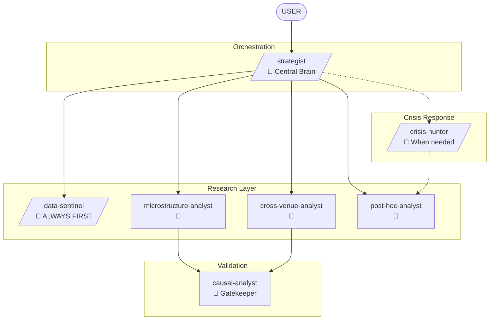

# Research Experts

Opinionated research agents for HFT quantitative research. Causality over fit. Interpretability over black-box. Every decision flows to user.

## Philosophy

- **Causality first** - mechanism over statistical fit
- **Interpretability** - understand why, not just that
- **User decides** - agents advise and ask, never assume
- **Deep by default** - dig until you understand
- **Complementary** - agents complete each other, not overlap

## Agents

### strategist - Central Brain
The orchestrator who knows the strategy inside-out. Decomposes questions, coordinates agents, challenges ideas, synthesizes findings. Asks complementary questions EVERY TIME before proceeding.

**Invokes**: All research agents
**Key trait**: Obsessive about understanding the full mechanism

---

### data-sentinel - Paranoid Data Guardian
MUST BE INVOKED FIRST on any data. Trusts nothing. Assumes all feeds are corrupt until proven otherwise. Asks user before any filter/transform.

**Invoked by**: strategist (always first), any agent needing data
**Key trait**: Pathologically suspicious of data quality

---

### microstructure-analyst - Econometrician
Order book dynamics, venue mechanics, information models. Builds structural models from economic foundations. Kyle, Glosten-Milgrom, Hawkes. Causal ML when appropriate.

**Invoked by**: strategist
**Escalates to**: causal-analyst (mechanism validation)
**Key trait**: Pattern without model is not alpha

---

### cross-venue-analyst - Statistics Purist
Multi-venue relationships, lead-lag, information transmission. Pre-registers hypotheses, corrects for multiple testing, demands out-of-sample validation.

**Invoked by**: strategist
**Escalates to**: causal-analyst (MANDATORY before tradeable claims)
**Key trait**: False discoveries offend personally

---

### causal-analyst - Gatekeeper
Destroys spurious correlations. DAGs, IV, RDD, DiD, sensitivity analysis. Validates mechanisms submitted by other agents. PASS/REJECT with full reasoning.

**Invoked by**: microstructure-analyst, cross-venue-analyst, strategist
**Key trait**: Correlation without mechanism is noise

---

### post-hoc-analyst - Forensic Investigator
Finds what we believed wrong. Traces assumption failures through the chain. Paranoid about everything. Asks before attributing blame.

**Invoked by**: strategist (periodic), crisis-hunter (after incidents)
**Key trait**: Never trust the first explanation

---

### crisis-hunter - Incident Commander
INVOKE when something breaks. Knows where bugs hide - integration points, assumption boundaries, temporal edges. Coordinates investigation.

**Invoked by**: user, strategist, any agent
**Hands off to**: post-hoc-analyst (after closure)
**Key trait**: "Fixed" is a hypothesis until verified

## Flow



## Key Rules

1. **data-sentinel FIRST** - always validate data before research
2. **causal-analyst VALIDATES** - no tradeable claims without mechanism
3. **strategist ASKS** - complementary questions every time
4. **USER DECIDES** - agents present options, never assume

## Venue Context

All agents read `EXCHANGE_CONTEXT.md` first and ask which venue mode applies.

---

## Color Scheme

❤️ RED = `strategist`, `crisis-hunter` (orchestrators)
💚 CYAN = `data-sentinel`, `microstructure-analyst`, `cross-venue-analyst`, `causal-analyst`, `post-hoc-analyst` (researchers)

## Installation

```bash
/plugin marketplace add git@github.com:DeevsDeevs/agent-system.git
/plugin install research-experts@deevs-agent-system
```
